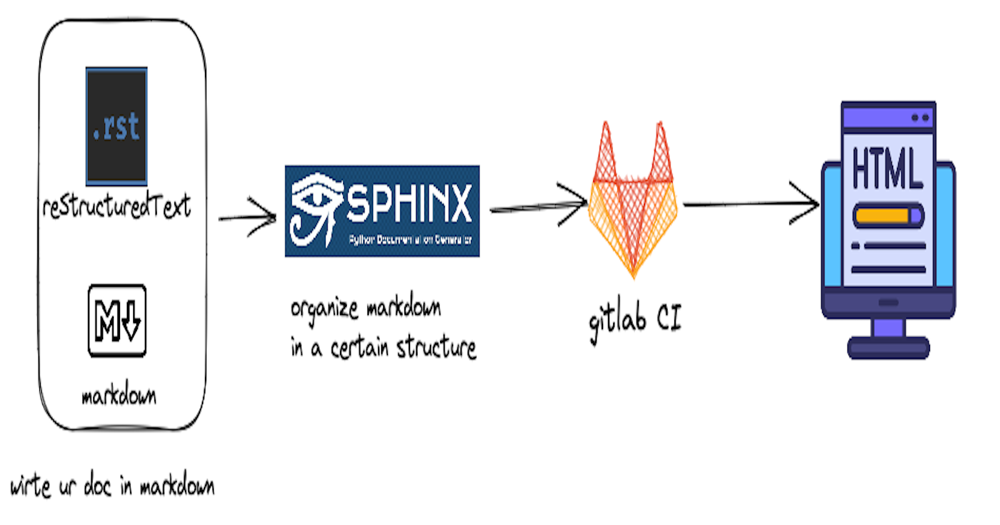
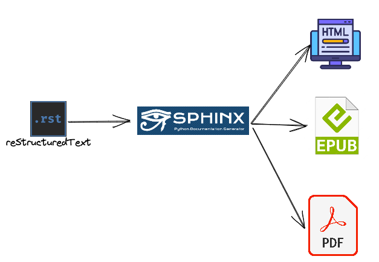
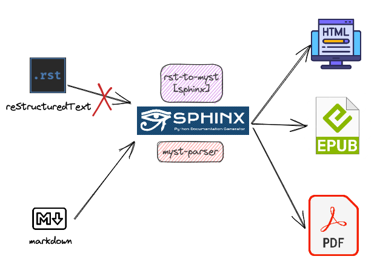

# Sphinx for documentation x Gitlab CI



## Motivation

Recently, i have been setting up an internal wiki for our data team about team best practice, guideline etc. I am setting it up since when i started, there isn't a centralized place for me to onboard easily. I feel like we def need one for the new comers! 

In this post, we will cover the following topics:
- Documentation with Sphinx 
- CI/CD with Gitlab CI


## Introduction to Sphinx

Sphinx is a framework for you to generate documentation and lot of documentation deployed on [read-the-docs](https://docs.readthedocs.io/en/latest/index.html) has been built with it such as pandas, numpy etc.

> Note: `pip install sphinx`

Sphinx takes input file written in a markup language called `reStructuredText` and output popular format such as html, epub and pdf.



**reStructuredText** is like **markdown** but we definitely don't want to pick up another markup language without offering too much benefits. 
Therefore, we need two problems we need solve and they are
- how to write in markdown instead of reStructuredText
- The sphinx framework only be able to compile reStructuredText

> Note: the solutions are `pip install rst-to-myst[sphinx]` and `pip install myst-parser`.


[MyST](https://jupyterbook.org/en/stable/content/myst.html), AKA, markdown-on-steriod, is developed as a drop-in replacement for markdown with richer rendering support. We are going to use `rst-to-myst[sphinx]` from pypi to make our world easier. Then we need our sphinx be able to compile markdown, therefore we need `myst-parser`

Now, our workflow looks like this,



In summary, we needs the following
- `pip install rst-to-myst[sphinx]` 
- `pip install sphinx`
	- read the doc style
- `pip install myst-parser` and doc [here](https://pypi.org/project/myst-parser/)
	- write ur doc with markdown dialet called [MyST markdown](https://mystmd.org/overview/ecosystem) . It has many rich syntax and compatible with sphinx.
	- To read on how to use MyST, please find [MyST read the docs here](https://myst-parser.readthedocs.io/en/latest/faq/index.html)


## Minimum Set-up

In this section, we are going to cover some commands for minimum setup, 

```bash

mkdir project
cd project

python -m venv .venv

# 
source .venv/bin/activate.fish

# this will install myst and sphinx as well
pip install rst-to-myst[sphinx]
pip install myst-parser
```

Now you have installed, you can
```bash
mkdir docs
cd docs

# initialize the docs
sphinx-quickstart
```

It will ask you a series of prompt, then

```bash
cd ..
# conver all of the stupid .rst to .md
rst2myst convert docs/**/*.rst
```

Now you should see `index.md` and `index.rst`. Let's remove the `index.rst`.

```bash
# remove the index.rst file
rm docs/source/index.rst

# You file structure should look like this
docs/
├── Makefile
├── build
├── make.bat
└── source
    ├── _static
    ├── _templates
    ├── conf.py
    └── index.md
```

Now we have two things to deal with,
|filename|description|
|-|-|
|`index.md`|like the `index.html` for any JS project. The main documentation source file and entrypoint. It defines the structure of your docs and provides an overview of the contents. Like the indexing page of a book.|
|`conf.py`|The configuration file for your sphinx project. It has settings to control, theme, extensions and various output format.|


Now you need to add an extensions in the `conf.py` and it should be good

```bash
nano docs/source/conf.py
```

You should modify `extensions` list by adding a `"myst_parser"`,

```bash
# from
extensions = []
# to
extensions = ["myst_parser"]
```

If you are on mac, just do the following to open up the html

```bash
# makt html
make html
# open with google chrome
open -a "Google Chrome" ./docs/build/html/index.html
```

### Tip1: Avoid rebuilding every single time

It's very annoy that we have to run these two commands manually to open up a new tab and view our updates.

```bash
make html
open -a "Google Chrome" ./docs/build/html/index.html
```

Is there anything similar to the live server VS-Code extensions? Just do the following.

```bash
pip install sphinx-autobuild

# auto-build and serve html at destination sphinx-autobuild <source> <destination>
sphinx-autobuild ./docs/source docs/build/html   
```

### Tip2: Use the theme

The default theme in your `conf.py` is `html_theme = 'alabaster'`. It's very basics. Install the new theme called [furo](https://pypi.org/project/furo/)

```bash
pip install furo
```
And go ham!
```bash
# remove
html_theme = 'alabaster'
# add
html_theme = 'furo'
```


## Deployment on gitlab page

gitlab page is basically github page for you to quickly deployed and showcase your work. Gitlab CI is a CI/CD tool and it's written in yaml file. The blog's focus is on sphinx and it won't be covered in details. Feel free to read their [documentation](https://docs.gitlab.com/ee/ci/) and [Fireship video](https://www.youtube.com/results?search_query=+CI%2Fcd) to understand CI/CD and how to use Gitlab CI.

Here is a summarized comparison,

|gitlab product|github product|description|
|-|-|-|
|gitlab CI|github action|CI tool, built in with the platform. You don't have to host it somewhere like Jenkins.|
|gitlab page|github page|Use their domain to publish some work.|


Feel free to modify the following `gitlab-ci.yml` file for your documentation!

```yaml
image: python:3.8.17-slim

# this pipeline has three stages
stages:          
  - test
  - deploy

test:
  stage: test
  script:
    # install myst and furo template
    - pip install -U rst-to-myst[sphinx]
    - pip install myst-parser
    - pip install furo==2023.7.26
    - sphinx-build -b html ./doc/source public
  only:
    - branches
  except:
    - main

pages:
  stage: deploy
  script:
    # install myst and furo template
    - pip install -U rst-to-myst[sphinx]
    - pip install myst-parser
    # encounters a furo bug that doesn't work
    - pip install furo==2023.7.26
    - sphinx-build -b html ./doc/source public
  artifacts:
    paths:
      - public
  only:
    - main
```

# Summary

In this blog, we covered how to use the documentation framework `sphinx` to build our documentation written in `markdown`. We also cover how to build a simple CI/CD pipeline to deploy your work on gitlab pages so it can be consumed internally or externally directly.


# Reference
- [medium post, 2018, simple tutorial](https://medium.com/@richdayandnight/a-simple-tutorial-on-how-to-document-your-python-project-using-sphinx-and-rinohtype-177c22a15b5b) 
- [sphinx documentation](https://www.sphinx-doc.org/en/master/tutorial/automatic-doc-generation.html)
- [youtube, 4 mins quick intro](https://www.youtube.com/watch?v=b4iFyrLQQh4&ab_channel=avcourt)https://www.youtube.com/watch?v=b4iFyrLQQh4&ab_channel=avcourt
- [PyData Global 2021, Document on Stereoid with Sphinx, Markdown and Read the Docs](https://www.youtube.com/watch?v=qRSb299awB0&ab_channel=PyData)
- [stackoverflow that got me clicked for sphinx](https://stackoverflow.com/questions/53668052/sphinx-cannot-find-my-python-files-says-no-module-named)
- [A Modern Set-up for Python Package Development](https://medium.com/swlh/a-modern-set-up-for-python-package-development-f60b27a26bd7)
