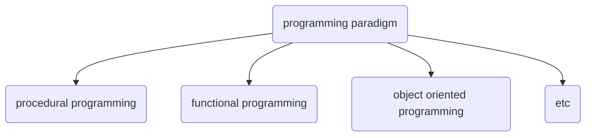

# generator in Python

Table of contents:
- [generator in Python](#generator-in-python)
  - [Motivation](#motivation)
  - [Introduction](#introduction)


## Motivation
I have been using `pyspark` lately for processing some geo-spatial data. The underlying concepts of `map, reduce`, `functional programming`, `generator function and iterator` really triggers my interest. 

This post is dedicated to learn `generator functions and iterator` and first step touch into functional programming.

## Introduction

The programming paradigm takes in many forms


You can think of it as karate, Judo, Kung Fu, Brazilian Jiu-Jitsu, Judo etc. It's all some sort of martial arts styles. 


Here's a tabular summary of procedural programming, functional programming, and object-oriented programming, highlighting their key characteristics:

| Aspect                      | Procedural Programming     | Functional Programming     | Object-Oriented Programming   |
|-----------------------------|---------------------------|---------------------------|-------------------------------|
| **Paradigm**                | Procedural                | Functional                | Object-Oriented               |
| **Primary Focus**           | Procedures and routines   | Functions and immutability| Objects and classes          |
| **Data Management**         | Typically uses global variables and data structures | Emphasizes immutability and pure functions | Encapsulates data in objects |
| **State Management**        | Relies on changing the state of variables | Avoids mutable state; uses recursion and higher-order functions | Manages state within objects |
| **Modularity**              | Organized around procedures and functions | Promotes reusable, composable functions | Promotes encapsulation and inheritance |
|Examples (Code)|-|`new_df = df.apply(function)`|-|
| **Examples (Languages)**    | C, Pascal, Fortran        | Haskell, Lisp, Scala      | Java, C++, Python             |


`Iterator`: an object that enables a programmer to traverse a container, particularly lists.

`Generator`: use a new syntax since python3 to make iterator greater again.


`iter()` and `next()`

```python
# old way of doing it
import sys

class Iter:
    def __init__(self, n):
        self.n = n

    def __iter__(self):
        self.current = -1
        return self

    def __next__(self):
        self.current += 1

        if self.current >= self.n:
            raise StopIteration

        return self.current        
```


