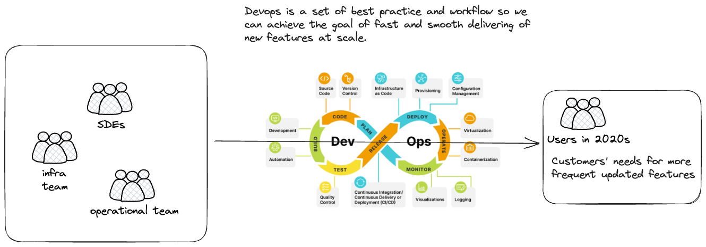

# DataOps

- [DataOps](#dataops)
  - [Introduction](#introduction)
  - [What's Devops](#whats-devops)
  - [software product vs data product](#software-product-vs-data-product)
  - [what's data-ops and how](#whats-data-ops-and-how)
  - [Summary](#summary)
  - [Reference](#reference)

## Introduction
I first came across the term DataOp multiple time in fundamentals of DE by Joe Reis and DE subreddit. It's time to pay a visit!

We will use the following structure:
- what's devops and why we need it?
- software product vs data product
- main difficulties

## What's Devops

To discuss dataops, we have to talk about devops first.

Back in 2000s, it is usually takes 1 year or a couple of months to release a new feature. At that time, it has been considered fast and users are happy with it.

Over the past 20 years or so, software company wants to add more features and release them to satisfies user's needs and to implement stakeholder's idea faster. It results in faster software release and user are spoiled so that they have expectations for software to be updated quickly when needed. It in return put greater pressure of releasing faster on the software company. 

Software company consists of teams of difference size and they all collaborate with each other to release software to production. It means that multiple teams need to collaborate together to achieve the same goal that is to deliver software features faster.

> Devops: a set of best practice and workflow for software teams to collaborate and achieve the same goal of fast and smooth software release at scale.

Devops roots from lean manufacturing and agile philosophy. Then it has been honed by many big-tech companies over the last 2 decades by trial and errors to perfect the art of devops and it continue to evolve (at a slower speed now). 

## software product vs data product

The difference between SDE team and DE team is that SDE delivers software while DE delivers data product to be consumed by BI and DS team.

|-|deliverables|
|-|-|
|SDE team + devops team|software product|
|DE team|data product|

Just like users want to play around with cool new features on instagram, DS and BI team also wants new data as fast as possible. 

For dev-ops of software product, we have the following tools in the pocket:
- ci/cd
- version control
- dev/qa/environment

Why can't we directly copy the best practice from dev-ops to data-ops then? What are exactly holding back the DE's development flow?
- It's hard to duplicate QA environment for ETL since it contains many source integration, infrastructure, cluster and VM configs. Hard to manage all of them in a code format unless some platform has been  
- DE involves too many tech stack and you changes pieces very quickly. It's a lot of work to maintain your CI/CD pipeline for deployment team.

Data-ops
## what's data-ops and how

## Summary

## Reference
- [meta engineering: rapid-release-at-massive-scale](https://engineering.fb.com/2017/08/31/web/rapid-release-at-massive-scale/)
- the book: Practical DataOps
