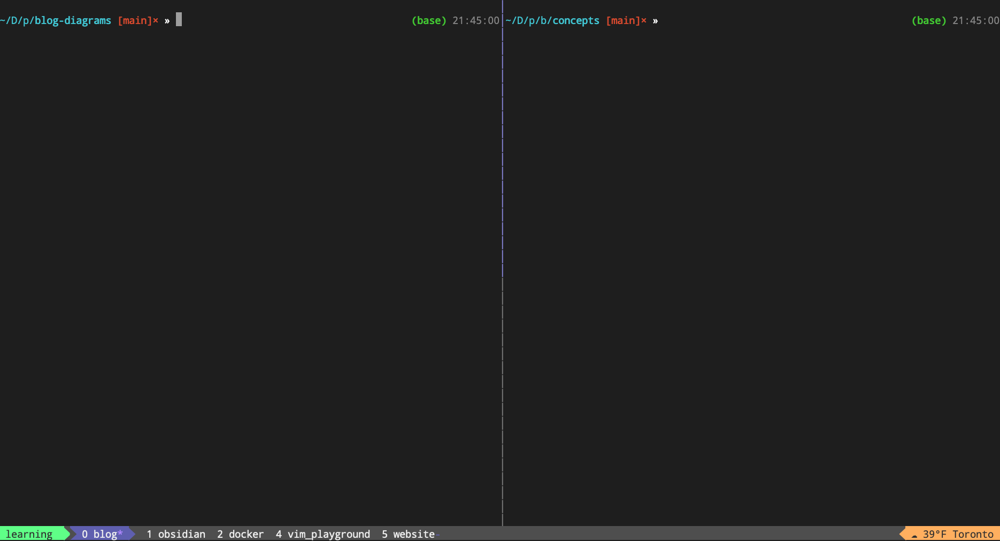
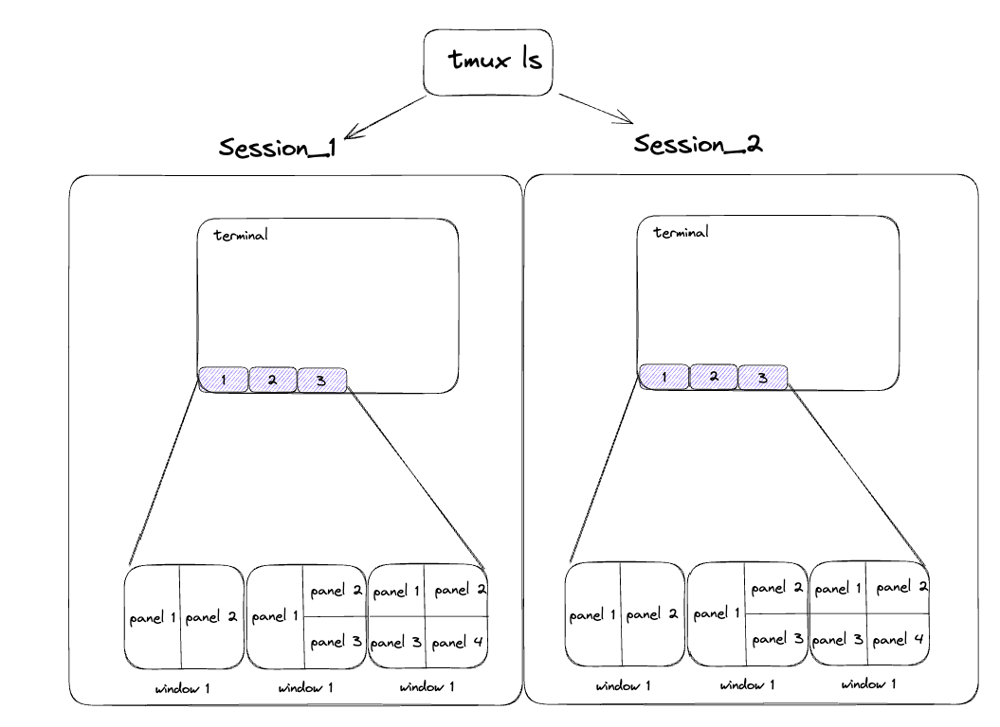

# Terminal Setup: tmux
- [Terminal Setup: tmux](#terminal-setup-tmux)
  - [Motivation](#motivation)
  - [Perspetive on tmux and vim](#perspetive-on-tmux-and-vim)
  - [Three pillars of tmux](#three-pillars-of-tmux)
    - [Install](#install)
    - [Sessions](#sessions)
    - [Windows and Panes](#windows-and-panes)
  - [Summary](#summary)
- [References](#references)


## Motivation

I have changed my workflow to `tmux` and `vim` lately. I'd like to share my experience with adopting these tools and focus on `tmux` and later post on `vim`. It's also in memory of Bram Moolenaar, the creator of vim, who passed away recently.

## Perspetive on tmux and vim

`tmux` is a terminal multiplexer (manager tool). It allows you to run multiple terminal sessions in one terminal window as illustrated below.



tmux is easy to learn and set-up. You won't probably need to learn more than 10 commands to use it. If you use terminal a lot, you should definitely use tmux.

`vim` is a text editor. It allows you to edit text files very lighting fast very greater learning curve. When people talks about vim, they are referring to two things:
- `vim motion`: the way you navigate and text editing in vim
- `vim editor`: the text editor itself

I mainly adopted the `vim motion` in my workflow and use `vscode` as my text editor (don't call me out on this, i like vscode too). I love vim but i am biased. The learning curve is steep and it takes time to get used to it. 

Please treat learning vim as a long term investment if you enjoy coding and editing a lot of stuff. My philosophy is to treat learning vim as learning instrument. You will feel like playing piano on the keyboard once you get used to it. 

Bram Moolenaar puts a lot of effort in vim to allow faster editing as long as you follow the vim way. Learning its pattern like `[cound]{operation}{motion}`, you can do a lot of things very fast. It's also closely tied with `sed` and `regex` which are very powerful tools.

In short, if you are a terminal user, you should use tmux. The overhead is very low and you can learn it in 10 mins and instant boost your productivity. If you are really serious about your craft and you want to learn an instrument on keyboard. Please start using `vim`. 

I will cover `vim` in another post. In this post, we will focus on `tmux`.


## Three pillars of tmux

Tmux has main three pillars,
- `session`: each session is a collection of windows
- `window`: each window is a collection of panes
- `pane`: panes are split of terminal screen



tmux treat each session as a process for you to attach and detach. Once you understand that there are only session, window and pane in tmux, you can categotize all the commands into these three categories,
- navigate between session, window and pane
- navigate in session, window and pane
- create/destory session, window and pane

Then you will be good to go.


### Install

There are loads of tutorials on how to install tmux. I will just list the commands here and give some recommendation at the end.
```
# mac
brew install tmux

# ubuntu
apt-get install tmux
```

### Sessions

For session just remember, new, kill and attach (a)
```bash
tmux new-session -s <session_name>

tmux kill-session -t <session_name>

# attach to tagged session
tmux attach -t <session_name>
```

### Windows and Panes

Everything in windows and panes are starting from `Ctrl + B`. You can refer to this amazing cheatsheet with `vi` that i found on [reddit](https://www.reddit.com/r/linux4noobs/comments/wqlkuy/cheatsheet_with_tmux_shortcuts/) for more details. 


## Summary

In this post we covered,
- perspective on tmux and vim
- understanding tmux basics
- some pointer to tmux cheatsheet and tmux tutorial to grab the concept faster

# References
- [HackerSploit, you should be tmux-ready in 10 mins](https://www.youtube.com/watch?v=Yl7NFenTgIo)